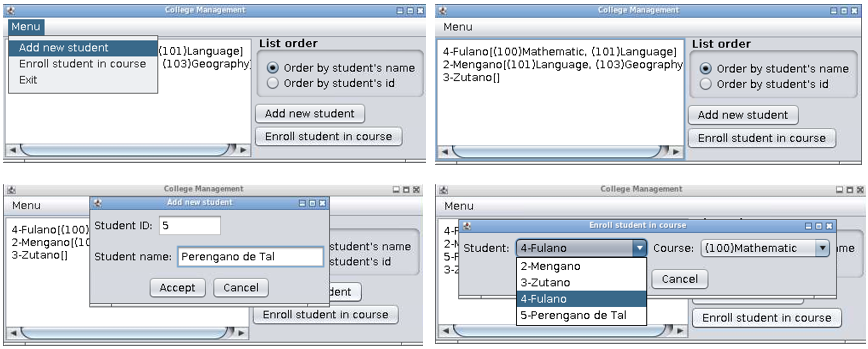

### Práctica 4: College Management

#### Objetivos didácticos

El objetivo de esta actividad es practicar el uso de las características de la Programación Orientada a Objetos de [herencia y polimorfismo](https://aulaga.dis.ulpgc.es/mod/resource/view.php?id=21278 "Herencia y Polimorfismo"); de los [contenedores](https://aulaga.dis.ulpgc.es/mod/resource/view.php?id=21293 "Contenedores"); y de la [interfaz gráfica de usuarios](https://aulaga.dis.ulpgc.es/mod/resource/view.php?id=21307 "Interfaz gráfica de usuarios") en Java.

#### Enunciado

Se desea desarrollar una aplicación con interfaz gráfica para la gestión de un centro educativo (college) que ofrece formación de un conjunto de asignaturas a los estudiantes pertenecientes al mismo. Una asignatura (course) se caracteriza por tener un nombre y un código (un número entero) que la identifica. Un alumno (student) se caracteriza mediante un nombre, un número entero como identificador y el conjunto de asignaturas en las que está matriculado (enrolled). El sistema debe tener funcionalidad para gestionar las asignaturas que oferta (offered courses) así como los estudiantes del centro educativo (enrolled students) y su matriculación.

#### Ejercicio a realizar (Parte 1)

El diseño de la aplicación que se plantea se desarrolla en dos partes. En la primera parte se requiere la realización del siguiente conjunto de clases: _Course_ , _Student_ , _EnrolledStudents_ , _OfferedCourses_ y _College_ .

En la segunda parte, se desarrollará la interfaz gráfica que permita la creación de estudiantes, así como la matrícula de estos en las asignaturas correspondientes.

La clase _Course_ representa una asignatura y requiere los siguientes métodos públicos:

| **Método**          | **Descripción**                                                                                                                     |
| ------------------- | ----------------------------------------------------------------------------------------------------------------------------------- |
| Course(int, String) | Constructor al que se le pasa un número entero con el identificador de la asignatura y una String con el nombre de la asignatura.   |
| int getCode()       | Devuelve el identificador de la asignatura.                                                                                         |
| String getName()    | Devuelve el nombre de la asignatura.                                                                                                |
| String toString()   | Devuelve una String formada por el identificador de la asignatura entre paréntesis ("("...")") seguido del nombre de la asignatura. |

La clase _Student_ requiere los siguientes métodos públicos:

| **Método**                                | **Descripción**                                                                                                                                                                                                                                                                                                                                          |
| ----------------------------------------- | -------------------------------------------------------------------------------------------------------------------------------------------------------------------------------------------------------------------------------------------------------------------------------------------------------------------------------------------------------- |
| Student(int, String)                      | Constructor al que se le pasa un número entero con el identificador y una String con el nombre del estudiante.                                                                                                                                                                                                                                           |
| int getId()                               | Devuelve el identificador del estudiante.                                                                                                                                                                                                                                                                                                                |
| String getName()                          | Devuelve el nombre del estudiante.                                                                                                                                                                                                                                                                                                                       |
| boolean enrollCourse(Course)              | Añade una nueva asignatura pasada por parámetro al conjunto de asignaturas de las que el estudiante está matriculado y devuelve verdadero si la añade, o devuelve falso si ya está matriculado de la asignatura.                                                                                                                                         |
| boolean unenrollCourse(int)               | Elimina la asignatura con el código pasado por parámetro de las que el estudiante está matriculado. Devuelve verdadero si la quita y falso si no se encuentra.                                                                                                                                                                                           |
| Collection`<Course>` getEnrolledCourses() | Devuelve una colección con las asignaturas en que está matriculado el estudiante, ordenada por el código de la asignatura.                                                                                                                                                                                                                               |
| String toString()                         | Devuelve una String formada por el identificador del estudiante seguido de un guión ("-") y del nombre del alumno, seguido de la concatenación de las asignaturas de las que está matriculado separados por una coma y un espacio en blanco (", ") entre los caracteres de abre y cierra corchete ("["..."]"), ordenadas por el código de la asignatura. |

La clase _EnrolledStudents_ representa el conjunto de estudiantes matriculados en el centro educativo y requiere los siguientes métodos públicos:

| **Método**                               | **Descripción**                                                                                                                                                                            |
| ---------------------------------------- | ------------------------------------------------------------------------------------------------------------------------------------------------------------------------------------------ |
| EnrolledStudents()                       | Constructor sin parámetros que inicializa a vacío el contenedor de alumnos matriculados.                                                                                                   |
| boolean addStudent(Student)              | Añade un estudiante al contenedor de alumnos registrados. Devuelve verdadero si lo ha añadido, o falso si ya está registrado un alumno con el mismo identificador.                         |
| boolean removeStudent(int)               | Elimina el estudiante con el identificador pasado por parámetro. Devuelve verdadero si lo quita y falso si no se encuentra.                                                                |
| Student getStudent(int)                  | Devuelve un estudiante a partir de su identificador. Si no existe devuelve null.                                                                                                           |
| List`<Student>` getStudentsByCourse(int) | Devuelve una lista de estudiantes matriculados en la asignatura con el código indicado en el parámetro, ordenados por nombre, y si tienen el mismo nombre, ordenados por su identificador. |
| List`<Student>` getStudentsOrderByName() | Devuelve una lista de estudiantes del centro educativo ordenados por nombre, y si tienen el mismo nombre, ordenados por su identificador.                                                  |
| List`<Student>` getStudentsOrderById()   | Devuelve una lista de estudiantes del centro educativo ordenados por el identificador.                                                                                                     |

La clase _OfferedCourses_ representa el conjunto de asignaturas que oferta el centro educativo. Requiere los siguientes métodos públicos:

| **Método**                  | **Descripción**                                                                                                                                                  |
| --------------------------- | ---------------------------------------------------------------------------------------------------------------------------------------------------------------- |
| OfferedCourses()            | Constructor sin parámetros que inicializa a vacío el contenedor de asignaturas ofertadas por el centro educativo.                                                |
| boolean addCourse(Course)   | Añade una asignatura al contenedor de asignaturas. Devuelve verdadero si la ha añadido, o falso si ya está registrada una asignatura con el mismo identificador. |
| boolean removeCourse(int)   | Elimina la asignatura con el identificador pasado por parámetro. Devuelve verdadero si la quita y falso si no se encuentra.                                      |
| Course getCourse(int)       | Devuelve una asignatura a partir de su identificador. Si no existe devuelve null.                                                                                |
| List`<Course>` getCourses() | Devuelve una lista con las asignaturas que oferta el centro educativo, ordenadas por el toString() de la asignatura (Course).                                    |

##### Notas:

-   Las distintas clases se deben desarrollar según los requisitos descritos en el enunciado, añadiendo los métodos de la clase **Object** y **comparadores** que cree oportunos para su correcto funcionamiento en el resto de la aplicación, usando los [contenedores](https://aulaga.dis.ulpgc.es/mod/resource/view.php?id=21293 "Contenedores") de la librería de Java más adecuados.
-   Las modificaciones que se hagan en los [contenedores](https://aulaga.dis.ulpgc.es/mod/resource/view.php?id=21293 "Contenedores") devueltos por los métodos en que esté especificado, no tienen que afectar a los [contenedores](https://aulaga.dis.ulpgc.es/mod/resource/view.php?id=21293 "Contenedores") de los objetos que requieran un contenedor.
-   Para la implementación de los **comparadores** se deben implementar las interfaces usando clases, [clases anidadas](https://aulaga.dis.ulpgc.es/mod/resource/view.php?id=21304 "Clases anidadas"), clases anónimas o lambdas. **No está permitido** el uso de métodos estáticos de utilidades de la clase “Comparator” del tipo “comparing…”, “thenComparing…” y similares.
-   Para borrar elementos de un contenedor no está permitido el uso del método "removeIf".
-   La práctica debe estar documentada usando el estándar [Javadoc](https://aulaga.dis.ulpgc.es/mod/resource/view.php?id=21251 "Javadoc").

#### Ejercicio a realizar (Parte 2)

El diseño de la aplicación que se plantea se desarrolla en dos partes. El desarrollo de la primera parte se realizó en la actividad: Parte 1.

En la segunda parte, se desarrollará la interfaz gráfica que permita la creación de estudiantes, así como la matrícula de estos en las asignaturas correspondientes. La aplicación deberá crear los diferentes componentes gráficos debiendo cumplir los siguientes requisitos:

-   Actualizar el orden de la lista de estudiantes según se seleccione en la interfaz de usuario.
-   Crear un nuevo estudiante mediante un diálogo disparado desde el botón u opción de menú correspondiente. La creación de un nuevo estudiante tiene que verse reflejada inmediatamente en la lista mostrada.
-   Matricular un estudiante en una asignatura mediante un diálogo disparado desde el botón u opción de menú correspondiente. La matrícula en la nueva asignatura debe verse reflejada inmediatamente en la lista mostrada.
-   La estética debe parecerse lo más posible a la que se muestra en las siguientes figuras.

En el último diálogo se usa un JComboBox inicializado con un array de [Strings](https://aulaga.dis.ulpgc.es/mod/resource/view.php?id=21260 "Strings") y tomando la opción seleccionada de su método getSelectedIndex(). Lo sencillo es tener almacenadas los objetos estudiantes y asignaturas en el mimo orden en que se muestran para poder realizar la operación de matrícula.

Las clases con el código a desarrollar deben pertenecer al paquete " _tp.practicas_ ".

**La práctica debe de estar documentada utilizando el estándar [Javadoc](https://aulaga.dis.ulpgc.es/mod/resource/view.php?id=21251 "Javadoc").**
